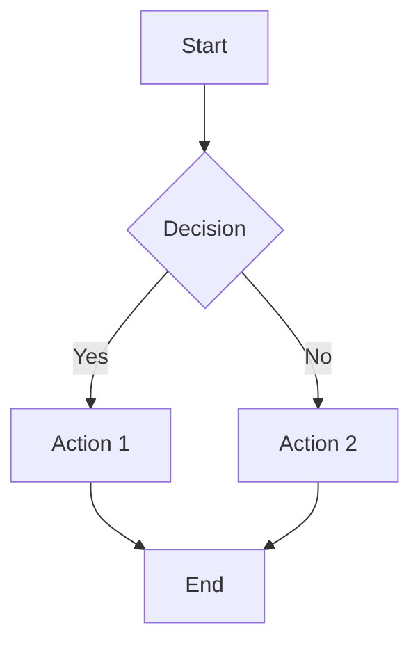
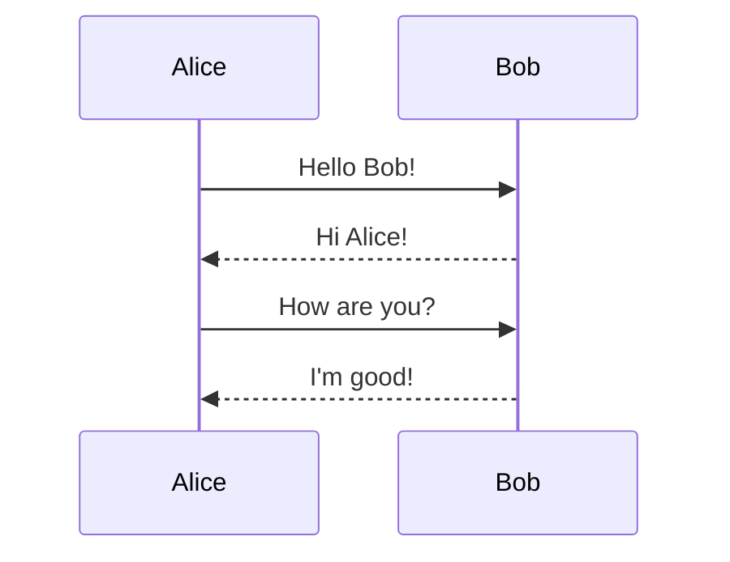
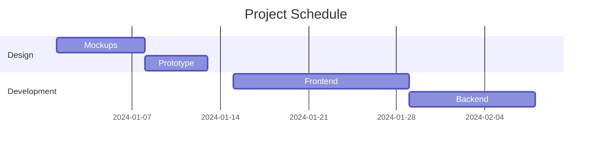

# 📊 Visual Diagrams Guide

**Create stunning visual diagrams in CogniNote!**

---

## 🎨 Overview

CogniNote supports **4 types of visual diagrams** to help you visualize ideas, processes, and information:

1. **Flowcharts** - Process flows and decision trees
2. **Mindmaps** - Hierarchical idea organization
3. **Whiteboards** - Freeform drawing and sketching
4. **Mermaid Diagrams** - Text-based diagrams

---

## 🔷 Flowcharts

### What are Flowcharts?

Flowcharts help you visualize processes, workflows, and decision trees with connected nodes.

### Features

- **Drag & Drop Nodes** - Create process steps easily
- **Multiple Node Types** - Input, process, decision, output
- **Connections** - Draw arrows between nodes
- **Auto-Layout** - Organize nodes automatically
- **Customization** - Colors, labels, and styles
- **Export** - Save as PNG or SVG

### How to Create

1. Click **"Create New"** → **"Flowchart"**
2. Drag nodes from the toolbar
3. Connect nodes by clicking handles
4. Double-click to edit labels
5. Save or export!

### Use Cases

- Business processes
- Software workflows
- Decision trees
- Algorithm visualization
- User flows

---

## 🧠 Mindmaps

### What are Mindmaps?

Mindmaps help you organize ideas hierarchically, branching from a central concept.

### Features

- **Central Node** - Start with main idea
- **Branch Nodes** - Add child concepts
- **Auto-Layout** - Dagre algorithm arranges nodes
- **Collapsible** - Expand/collapse branches
- **Colors** - Color-code categories
- **Export** - Save your mindmap

### How to Create

1. Click **"Create New"** → **"Mindmap"**
2. Start with central idea
3. Click **"Add Child"** to branch
4. Organize automatically
5. Customize and save!

### Use Cases

- Brainstorming
- Project planning
- Study notes
- Knowledge organization
- Creative thinking

---

## 🎨 Whiteboards

### What are Whiteboards?

Whiteboards provide infinite canvas for freeform drawing, sketching, and diagramming.

### Features

- **Freeform Drawing** - Sketch anything
- **Shapes** - Rectangle, circle, arrow, line
- **Text** - Add labels and notes
- **Images** - Insert images
- **Pen Tool** - Natural drawing
- **Collaboration** - Real-time multi-user (coming soon)
- **Export** - Save as image

### How to Create

1. Click **"Create New"** → **"Whiteboard"**
2. Select tool from toolbar
3. Draw on infinite canvas
4. Pan and zoom as needed
5. Export when done!

### Use Cases

- Design mockups
- Brainstorming sessions
- Sketching ideas
- Visual explanations
- Teaching diagrams

---

## 📐 Mermaid Diagrams

### What are Mermaid Diagrams?

Mermaid lets you create diagrams using simple text syntax - perfect for developers!

### Supported Diagram Types

- **Flowcharts** - Process flows
- **Sequence Diagrams** - Interactions over time
- **Gantt Charts** - Project timelines
- **Class Diagrams** - OOP structures
- **State Diagrams** - State machines
- **Pie Charts** - Data visualization
- **Git Graphs** - Branch visualization

### How to Create

1. Click **"Create New"** → **"Mermaid Diagram"**
2. Write diagram code
3. See live preview
4. Save or export!

### Examples

**Flowchart:**


**Sequence Diagram:**


**Gantt Chart:**


### Use Cases

- Technical documentation
- Architecture diagrams
- Project planning
- Code visualization
- API documentation

---

## 🎯 Comparison

| Feature | Flowcharts | Mindmaps | Whiteboards | Mermaid |
|---------|------------|----------|-------------|---------|
| **Interactive** | ✅ | ✅ | ✅ | ⚠️ Preview |
| **Text-Based** | ❌ | ❌ | ❌ | ✅ |
| **Auto-Layout** | ✅ | ✅ | ❌ | ✅ |
| **Freeform** | ❌ | ❌ | ✅ | ❌ |
| **Version Control** | ⚠️ | ⚠️ | ❌ | ✅ |
| **Learning Curve** | Easy | Easy | Easy | Moderate |

---

## 🚀 Quick Tips

### Flowcharts
- Use consistent node types
- Label all connections
- Keep flows simple
- Use colors for clarity

### Mindmaps
- Start with clear central idea
- Group related concepts
- Use colors for categories
- Keep branches organized

### Whiteboards
- Use shapes for structure
- Combine drawing with text
- Group related elements
- Export frequently

### Mermaid
- Learn basic syntax first
- Use comments for clarity
- Keep diagrams simple
- Version control friendly

---

## 🎨 Best Practices

### General

1. **Keep It Simple** - Don't overcomplicate
2. **Use Colors** - Visual categorization
3. **Add Labels** - Clear descriptions
4. **Save Often** - Don't lose work
5. **Export** - Backup as images

### Collaboration

- Use whiteboards for team sessions
- Share flowcharts for processes
- Mindmaps for brainstorming
- Mermaid for technical docs

---

## 📚 Resources

### Learn More

- [React Flow Docs](https://reactflow.dev/)
- [Dagre Layout](https://github.com/dagrejs/dagre)
- [Excalidraw](https://excalidraw.com/)
- [Mermaid Documentation](https://mermaid.js.org/)

### Tutorials

- Flowchart best practices
- Mindmapping techniques
- Visual thinking guides
- Mermaid syntax reference

---

## ✨ Examples

### Business Process Flow
```
Start → Receive Order → Check Stock → 
{In Stock?} → Yes → Process Payment → Ship → End
           → No → Order More → Process Payment → Ship → End
```

### Project Mindmap
```
Project Launch
├── Planning
│   ├── Goals
│   ├── Timeline
│   └── Budget
├── Execution
│   ├── Development
│   ├── Testing
│   └── Deployment
└── Review
    ├── Metrics
    └── Feedback
```

### Whiteboard Use
- UI/UX mockups
- Architecture sketches
- Brainstorm captures
- Meeting notes

---

## 🎯 When to Use Each

**Use Flowcharts when:**
- Documenting processes
- Making decisions
- Planning workflows
- Teaching procedures

**Use Mindmaps when:**
- Brainstorming ideas
- Organizing information
- Learning new topics
- Planning projects

**Use Whiteboards when:**
- Free-form ideation
- Visual collaboration
- Quick sketches
- Design work

**Use Mermaid when:**
- Technical documentation
- Version-controlled diagrams
- Code-based workflows
- Simple syntax preferred

---

## ✅ Summary

CogniNote provides **4 powerful diagram types** for every visualization need:

✅ **Flowcharts** - Structured process flows  
✅ **Mindmaps** - Hierarchical idea organization  
✅ **Whiteboards** - Freeform creativity  
✅ **Mermaid** - Text-based technical diagrams  

Choose the right tool for your task and visualize your ideas effectively!

**Start creating diagrams now in CogniNote!** 🚀
